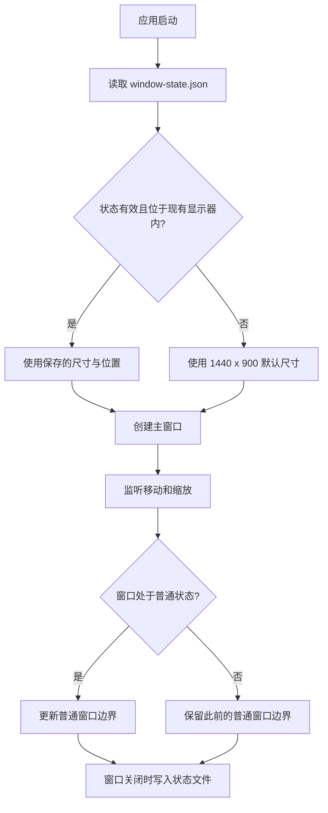

# Electron 窗口尺寸与位置恢复设计

日期：2026-07-12

## 目标

桌面应用关闭后保存主窗口的普通状态尺寸与位置，并在下次启动时恢复。最大化和全屏状态不保存为启动状态，也不在下次启动时恢复。

## 方案

使用 `electron-window-state` 管理主窗口状态，不在项目中重复实现文件读写、窗口事件合并和显示器范围检查。

在 `createWindow()` 创建 `BrowserWindow` 前初始化状态管理器：

- 默认宽度为 `1440`，默认高度为 `900`；
- `maximize` 设为 `false`；
- `fullScreen` 设为 `false`；
- 将状态管理器提供的 `x`、`y`、`width`、`height` 传入 `BrowserWindow`；
- 窗口创建后调用 `manage(win)`，由库监听移动、缩放和关闭事件。

状态文件使用库的默认位置，即 Electron 的 `userData/window-state.json`。

## 状态流程

## 边界处理

- 状态文件不存在、无法读取、内容损坏或尺寸非法时，使用默认尺寸。
- 保存的位置不再位于任何现有显示器内时，使用安全的默认位置和尺寸，避免窗口落在已移除的外接显示器上。
- 最大化、最小化或全屏期间不覆盖此前记录的普通窗口边界。
- 即使状态文件记录了最大化或全屏标记，也因为配置关闭而不恢复这些状态。
- 保留 `BrowserWindow` 现有的最小宽高、隐藏式标题栏、背景色和延迟显示设置。

## 构建接入

`electron-window-state` 加入桌面包的运行时依赖。主进程由 `tsdown` 构建，依赖随主进程产物打包，不将该库加入 `neverBundle`，因此无需扩大 electron-builder 的文件白名单。

## 验证

1. 运行桌面包类型检查。
2. 运行桌面包测试。
3. 构建主进程，确认 CommonJS 依赖能够被正确打入 ESM 产物。
4. 手工启动桌面应用，移动并调整窗口大小后关闭；再次启动，确认普通窗口尺寸和位置恢复。
5. 将窗口最大化或全屏后关闭；再次启动，确认仍恢复此前的普通窗口尺寸和位置，而不是最大化或全屏。

## 不在范围内

- 不恢复最大化状态。
- 不恢复全屏状态。
- 不管理启动错误窗口或未来可能增加的其他窗口。
- 不新增自研窗口状态存储模块。
